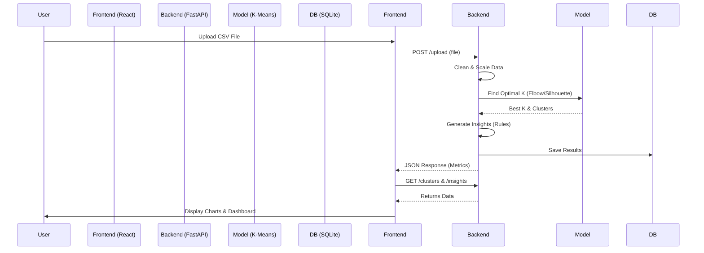

# Customer Segmentation AI Project Documentation

This document provides a comprehensive guide to the Customer Segmentation AI project, including architecture, setup instructions, usage guide, and technical details.

## 📖 Project Overview

The **Customer Segmentation AI** is a production-ready web application that empowers businesses to group customers based on their behavior using Machine Learning. By uploading customer transaction data, the system automatically:
1.  **Cleans and Preprocesses** the data.
2.  **Determines the Optimal Number of Segments** (Clusters) using the Elbow Method and Silhouette Analysis.
3.  **Segments Customers** using the K-Means algorithm.
4.  **Generates Business Insights** explaining the characteristics of each segment (e.g., "High Value", "At Risk").
5.  **Visualizes** the data through interactive charts.

---

## 🏗 Architecture

The application follows a modern **Client-Server** architecture.

### **Tech Stack**

| Component | Technology | Description |
| :--- | :--- | :--- |
| **Frontend** | **React 18** (Vite) | Fast, interactive UI with **TypeScript**. |
| **Styling** | **TailwindCSS** | Utility-first CSS for responsive design. |
| **Visualization** | **Recharts** | Interactive charts for data analysis. |
| **Backend** | **FastAPI** | High-performance Python web API. |
| **ML Engine** | **Scikit-Learn** | K-Means clustering, StandardScaler, Metrics. |
| **Data Processing** | **Pandas, NumPy** | Data manipulation and analysis. |
| **Database** | **SQLite** | Lightweight persistence for processed results. |

### **Data Flow**



---

## 🚀 Getting Started

Follow these steps to set up the project locally on **Windows**.

### **Prerequisites**
- **Python 3.9+** (Ensure "Add Python to PATH" is checked during installation)
- **Node.js v16+** & **npm**

### **1. Backend Setup**

1.  Open a terminal (PowerShell or Command Prompt) and navigate to the project folder:
    ```bash
    cd customer-segmentation-ai/backend
    ```
2.  (Optional) Create a virtual environment to keep dependencies isolated:
    ```bash
    python -m venv venv
    venv\Scripts\activate
    ```
3.  Install the required Python packages:
    ```bash
    pip install -r requirements.txt
    ```
4.  Start the FastAPI server:
    ```bash
    uvicorn main:app --reload
    ```
    *The server will start at `http://127.0.0.1:8000`*

### **2. Frontend Setup**

1.  Open a **new** terminal window and navigate to the frontend folder:
    ```bash
    cd customer-segmentation-ai/frontend
    ```
2.  Install the Node.js dependencies:
    ```bash
    npm install
    ```
3.  Start the development server:
    ```bash
    npm run dev
    ```
    *The app will be accessible at `http://localhost:5173`*

---

## 🖥 User Guide

### **1. Data Preparation**
Prepare a CSV file with your customer data. The file **must** contain numerical columns for the model to work effectively. Recommended columns:
- `Annual Income (k$)`
- `Spending Score (1-100)`
- `Age`
- `Purchase Frequency`
- `Total Spending`

*Note: Non-numeric columns (like Gender) are currently ignored by the clustering algorithm but preserved in the output.*

### **2. Upload & Analysis**
1.  Go to `http://localhost:5173`.
2.  Click **"Select a file"** or drag & drop your CSV.
3.  Click **"Analyze Segments"**.
4.  Wait for the process to complete (usually 1-2 seconds).

### **3. Dashboard Features**
- **Metrics**: View the optimal number of clusters found (K) and model performance scores.
- **Charts**:
    - **Scatter Plot**: Visualizes clusters based on Income vs. Spending.
    - **Distribution**: Shows the percentage of customers in each segment.
- **Insights**: Read textual descriptions of each customer group (e.g., "Cluster 0: High Income, Low Spending").

### **4. Export**
Click the **"Download Report"** button to download a new CSV files that includes your original data plus:
- `Cluster`: The assigned cluster ID (0, 1, 2...).
- `CustomerSegment`: A descriptive label (e.g., "High Value Customer").

---

## 🔧 Technical Details

### **Backend API Endpoints**

| Method | Endpoint | Description |
| :--- | :--- | :--- |
| `POST` | `/upload` | Accepts a multipart CSV file. Cleans data, trains K-Means, saves to DB, returns metrics. |
| `GET` | `/clusters` | Returns the full dataset with assigned clusters from the database. |
| `GET` | `/insights` | Returns generated business insights (labels, stats) for each cluster. |
| `GET` | `/download` | Generates and returns a downloadable CSV of the results. |

### **Machine Learning Logic**

The core logic resides in `backend/model.py` and `backend/preprocessing.py`.

1.  **Preprocessing**:
    - Missing values are dropped (robustness).
    - All numerical columns are automatically identified.
    - Data is scaled using `StandardScaler` (Mean=0, Variance=1) to ensure all features contribute equally.

2.  **Model Selection (Auto-K)**:
    - The system iterates K from 2 to 10.
    - Calculates **Inertia** (Sum of squared distances) and **Silhouette Score**.
    - Uses a heuristic to pick the Best K: Prefer the highest Silhouette Score to ensure well-separated clusters.

3.  **Insight Generation** (`backend/insights.py`):
    - After clustering, the system calculates the mean values of Income, Spending, and Frequency for each cluster.
    - It compares these means to the **Global Average**.
    - **Rule-based labeling**:
        - High Income + High Spending -> **"High Value Customer"**
        - High Income + Low Spending -> **"Potential Saver"**
        - Low Income + High Spending -> **"High Risk Customer"** / "Careless Splurger"
        - Others -> "Standard/Medium Value"

---

## ❓ Troubleshooting

| Issue | Possible Solution |
| :--- | :--- |
| **`npm : File ... cannot be loaded because running scripts is disabled`** | Run this in PowerShell: `Set-ExecutionPolicy -ExecutionPolicy Bypass -Scope Process` |
| **`uvicorn is not recognized`** | Ensure the virtual environment is activated (`venv\Scripts\activate`) or use `python -m uvicorn ...` |
| **Upload fails with "500 Error"** | Check the backend terminal logs. Ensure your CSV has valid numerical data. |
| **Charts show no data** | Ensure your CSV columns are named somewhat standardly (e.g., "Income", "Score") for the charts to auto-pick axes, although the scatter plot tries to be smart. |

---

## 📝 License

This project is open-source and available for educational and business use.
